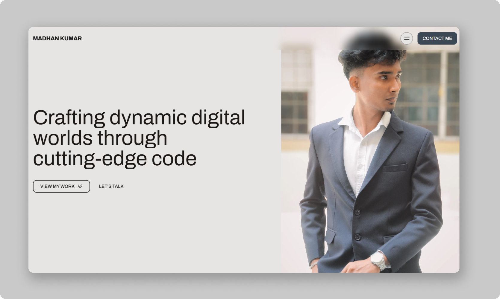

# Madhan Kumar Portfolio 🚀

Welcome to my personal portfolio repository! This project showcases my skills, projects, and experience as a web developer. The portfolio is designed to be modern, responsive, and user-friendly, highlighting my expertise in front-end and full-stack development.

## Features 🌟

- **About Me**: A brief introduction to my background, skills, and passion for web development.
- **Projects**: A showcase of my key projects with descriptions, technologies used, and links to live demos or repositories.
- **Skills**: A comprehensive list of my technical skills, including programming languages, frameworks, and tools.
- **Contact**: Easy-to-use contact form and links to my social profiles (e.g., GitHub, LinkedIn) for networking and inquiries.
- **Responsive Design**: Optimized for seamless viewing on desktops, tablets, and mobile devices.

## Technologies Used 🛠️

- **Frontend**: React.js, JavaScript (ES6+), HTML5, CSS3, Tailwind CSS
- **Deployment**: Vercel
- **Version Control**: Git, GitHub
- **Others**: Node.js, npm, Vite (or Create React App, based on setup)

## Preview Image 📸

## Contact 📬

Feel free to reach out for collaboration, job opportunities, or feedback:
- **Email**: devmadhan24@gmail.com
- **GitHub**: [github.com/Dev-Madhan](https://github.com/your-username)
- **Instagram**: [instagram.com/mxddy.ex](https://www.instagram.com/mxddy.ex)

Thank you for visiting my portfolio repository! Contributions and suggestions are welcome via pull requests or issues on this repository.